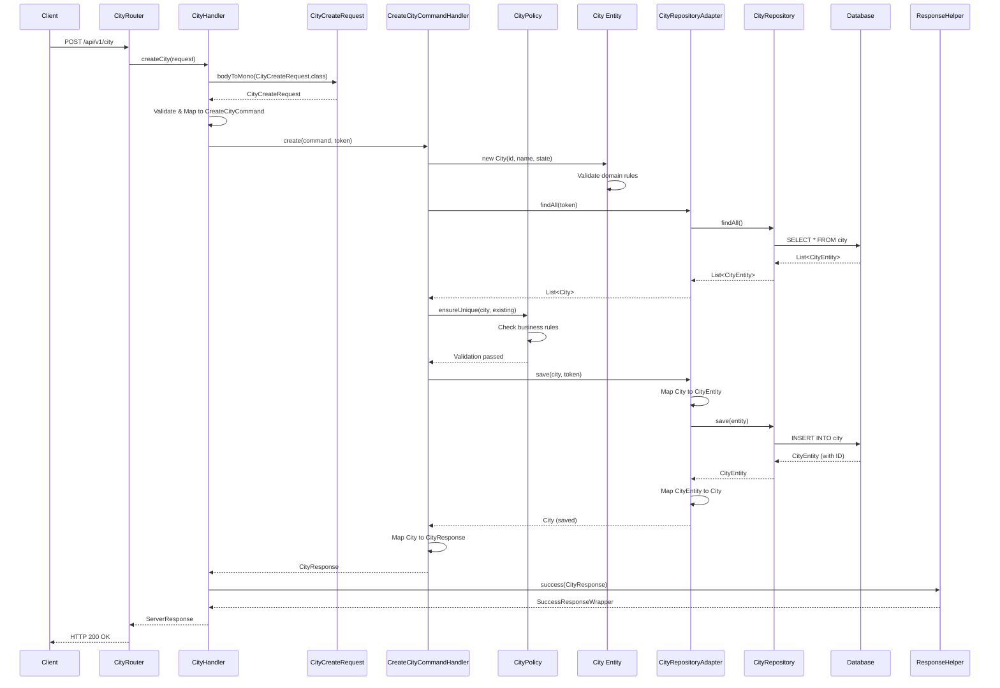
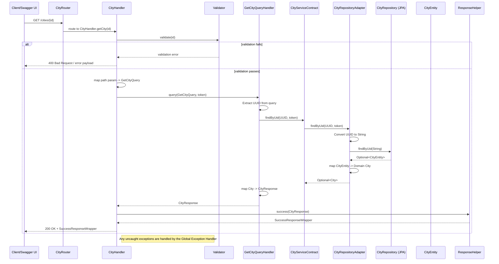
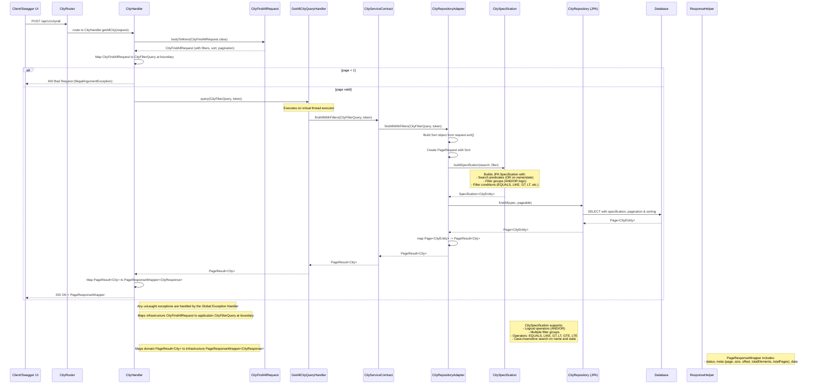

# Architecture Block Diagram

This document provides a comprehensive block diagram of the Spring Hexagonal Architecture implementation.

## Overall Architecture Diagram

```mermaid
graph TB
    subgraph "External Layer"
        Client[Client/Swagger UI]
    end

    subgraph "Infrastructure Layer - REST"
        Router[CityRouter<br/>Route Configuration]
        Handler[CityHandler<br/>HTTP Handler]
        RequestDTO[Request Objects<br/>CityCreateRequest<br/>CityFindAllRequest]
        ResponseHelper[ResponseHelper<br/>Response Wrapper Utility]
        PageResponse[PageResponseWrapper<br/>Pagination Response]
        Validator[Validator]
        ExceptionHandler[Global Exception Handler]
        APISpec[CitySpec<br/>OpenAPI Specification]
    end

    subgraph "Application Layer"
        subgraph "Ports In"
            CommandUseCase[CommandUseCase Interface]
            QueryUseCase[QueryUseCase Interface]
        end
        
        subgraph "Services"
            CreateCityCommandHandler[CreateCityCommandHandler<br/>Command Handler]
            GetCityQueryHandler[GetCityQueryHandler<br/>Query Handler]
            GetAllCityQueryHandler[GetAllCityQueryHandler<br/>Query Handler]
        end
        
        subgraph "Commands & Queries"
            CreateCityCommand[CreateCityCommand]
            GetCityQuery[GetCityQuery]
            CityFilterQuery[CityFilterQuery<br/>Application Query Object]
        end
        
        subgraph "Ports Out"
            ServiceContract[ServiceContract Interface]
            CityServiceContract[CityServiceContract Interface]
        end
    end

    subgraph "Domain Layer"
        subgraph "Entities"
            City[City Entity]
        end
        
        subgraph "Value Objects"
            CityId[CityId]
            State[State]
        end
        
        subgraph "Policies"
            CityPolicy[CityPolicy Interface]
            CityPolicyEnforcer[CityPolicyEnforcer<br/>Business Rules]
        end
        
        subgraph "Exceptions"
            DomainExceptions[Domain Exceptions<br/>InvalidCityNameException<br/>InvalidStateNameException<br/>DuplicateCityException]
        end
    end

    subgraph "Infrastructure Layer - Persistence"
        RepoAdapter[CityRepositoryAdapter<br/>Persistence Adapter]
        EntityMapper[Entity Mapper]
        Repository[CityRepository<br/>JPA Repository]
        Entity[CityEntity<br/>JPA Entity]
        CitySpec[CitySpecification<br/>JPA Query Specification]
        PersistenceExceptions[DatabaseException]
    end

    subgraph "Infrastructure Layer - Configuration"
        ExecutorConfig[Executor Configuration<br/>VirtualThreadExecutor<br/>CPUExecutor]
        AuditingConfig[Auditing Configuration]
        JacksonConfig[Jackson Configuration]
        APIDocConfig[API Documentation<br/>CityGroup<br/>GroupedOpenApiProvider]
    end

    subgraph "Data Store"
        Database[(H2 Database)]
    end

    %% Client to Infrastructure REST
    Client -->|HTTP Request| Router
    Router -->|Route to Handler| Handler
    Handler -->|Maps from| RequestDTO
    Handler -->|Validate| Validator
    APISpec -.->|Defines specs for| Handler
    
    %% Infrastructure REST to Application
    Handler -->|Command| CreateCityCommandHandler
    Handler -->|Query| GetCityQueryHandler
    Handler -->|Query| GetAllCityQueryHandler
    Handler -->|Wrap Response| ResponseHelper
    Handler -.->|Error Handling| ExceptionHandler
    
    %% Application Layer Connections
    CreateCityCommandHandler -.->|implements| CommandUseCase
    GetCityQueryHandler -.->|implements| QueryUseCase
    GetAllCityQueryHandler -.->|implements| QueryUseCase
    CreateCityCommandHandler -->|uses| CreateCityCommand
    GetCityQueryHandler -->|uses| GetCityQuery
    GetAllCityQueryHandler -->|uses| CityFilterQuery
    CreateCityCommandHandler -->|calls| CityServiceContract
    GetCityQueryHandler -->|calls| CityServiceContract
    GetAllCityQueryHandler -->|calls| CityServiceContract
    CityServiceContract -.->|extends| ServiceContract
    
    %% Application to Domain
    CreateCityCommandHandler -->|creates & validates| City
    CreateCityCommandHandler -->|enforces| CityPolicy
    CityPolicyEnforcer -.->|implements| CityPolicy
    City -->|contains| CityId
    City -->|contains| State
    City -.->|throws| DomainExceptions
    
    %% Infrastructure Persistence Implementation
    RepoAdapter -.->|implements| CityServiceContract
    RepoAdapter -->|maps| EntityMapper
    RepoAdapter -->|uses| Repository
    RepoAdapter -->|builds| CitySpec
    RepoAdapter -.->|throws| PersistenceExceptions
    Repository -->|queries with| CitySpec
    Repository -->|persists| Entity
    Entity -->|stores in| Database
    
    %% Configuration Support
    ExecutorConfig -.->|provides executors to| Handler
    ExecutorConfig -.->|provides executors to| CreateCityCommandHandler
    AuditingConfig -.->|audits| Entity
    APIDocConfig -.->|configures| Router
    
    %% Response Path
    Handler -->|Paginated Response| PageResponse
    PageResponse -->|Wraps data| ResponseHelper
    Handler -->|Success/Error Response| Router
    Router -->|HTTP Response| Client

    %% Styling
    classDef infrastructure fill:#e1f5ff,stroke:#01579b,stroke-width:2px
    classDef application fill:#fff9c4,stroke:#f57f17,stroke-width:2px
    classDef domain fill:#c8e6c9,stroke:#2e7d32,stroke-width:2px
    classDef external fill:#f3e5f5,stroke:#4a148c,stroke-width:2px
    classDef data fill:#ffccbc,stroke:#bf360c,stroke-width:2px
    
    class Router,Handler,RequestDTO,ResponseHelper,PageResponse,Validator,ExceptionHandler,APISpec,RepoAdapter,EntityMapper,Repository,Entity,CitySpec,PersistenceExceptions,ExecutorConfig,AuditingConfig,JacksonConfig,APIDocConfig infrastructure
    class CommandUseCase,QueryUseCase,CreateCityCommandHandler,GetCityQueryHandler,GetAllCityQueryHandler,CreateCityCommand,GetCityQuery,CityFilterQuery,ServiceContract,CityServiceContract application
    class City,CityId,State,CityPolicy,CityPolicyEnforcer,DomainExceptions domain
    class Client external
    class Database data
```



## Layer Descriptions

### 1. External Layer
- **Client/Swagger UI**: External consumers of the API, including Swagger UI for testing and documentation

### 2. Infrastructure Layer - REST
- **CityRouter**: Routes HTTP requests to appropriate handlers using Spring WebFlux functional routing
- **CityHandler**: Handles HTTP requests, validates input, and orchestrates use cases. Maps requests inline to commands/queries
- **Request Objects**:
  - `CityCreateRequest`: Request DTO for creating cities with validation annotations
  - `CityFindAllRequest`: Request DTO for filtering and paginating city queries with support for complex filtering (logical operators AND/OR, filter groups, conditions with EQUALS/LIKE/GT/LT/GTE/LTE operators), sorting, and searching. Mapped to `CityFilterQuery` at infrastructure boundary
- **ResponseHelper**: Utility class for wrapping responses in SuccessResponseWrapper or PageResponseWrapper
- **PageResponseWrapper**: Response wrapper for paginated results with metadata (page, size, offset, totalElements, totalPages)
- **Validator**: Validates incoming request data
- **Global Exception Handler**: Centralized error handling and response formatting
- **CitySpec**: OpenAPI specification constants for API documentation, including summaries, descriptions, and examples
- **Note**: CityMapper exists in the codebase but is currently unused; mapping is done inline in handlers and use cases

### 3. Application Layer
- **Ports In (Inbound Ports)**:
  - `CommandUseCase`: Interface for command operations (create, update, delete)
  - `QueryUseCase`: Interface for query operations (read)
  
- **Services**:
  - `CreateCityCommandHandler`: Implements business logic for city commands
  - `GetCityQueryHandler`: Implements query logic for retrieving a single city by its unique identifier (UUID)
  - `GetAllCityQueryHandler`: Implements query logic for retrieving multiple cities with pagination, sorting, and search
  
- **Commands & Queries**:
  - `CreateCityCommand`: Command object for creating cities
  - `GetCityQuery`: Query object for retrieving a single city by ID
  - `CityFilterQuery`: Application-layer query object for filtering/paginating cities (independent of infrastructure)
  
- **Ports Out (Outbound Ports)**:
  - `ServiceContract`: Generic interface for persistence operations
  - `CityServiceContract`: City-specific persistence port extending ServiceContract

### 4. Domain Layer (Core Business Logic)
- **Entities**:
  - `City`: Core domain entity with identity, attributes, and business behavior
  
- **Value Objects**:
  - `CityId`: Unique identifier for cities (UUID-based)
  - `State`: Value object representing US state
  
- **Policies**:
  - `CityPolicy`: Interface defining business rules
  - `CityPolicyEnforcer`: Implements business rules like uniqueness validation
  
- **Exceptions**:
  - Domain-specific exceptions for business rule violations

### 5. Infrastructure Layer - Persistence
- **CityRepositoryAdapter**: Adapter implementing `CityServiceContract`, translating domain operations to JPA operations
- **Entity Mapper**: Maps between domain models (`City`) and persistence entities (`CityEntity`)
- **CityRepository**: Spring Data JPA repository interface with support for Specification-based queries
- **CitySpecification**: JPA Specification builder for advanced filtering with logical operators (AND/OR), filter groups, and multiple condition types (EQUALS, LIKE, GT, LT, GTE, LTE). Supports both simple search and complex filtering scenarios
- **CityEntity**: JPA entity with database annotations
- **DatabaseException**: Custom exception for database-related errors

### 6. Infrastructure Layer - Configuration
- **Executor Configuration**: Configures thread executors (virtual threads for I/O, platform threads for CPU)
- **Auditing Configuration**: Configures JPA auditing for created/modified timestamps
- **Jackson Configuration**: Configures JSON serialization/deserialization
- **API Documentation Configuration**:
  - `CityGroup`: Configures grouped OpenAPI documentation for City endpoints
  - `GroupedOpenApiProvider`: Interface for creating customized OpenAPI groups with common headers (Authorization, Accept-Language, Currency) and response codes

### 7. Data Store
- **H2 Database**: In-memory database for development and testing

## Data Flow: Create City Example



## GetCity Flow Diagram

The diagram below shows the detailed runtime flow for the "getCity" query (GET /cities/{id}). It illustrates how an incoming HTTP request travels from the REST layer through the application and persistence layers and back to the client, including validation, mapping, and error handling.



## GetAllCity Flow Diagram

The diagram below shows the detailed runtime flow for the "getAllCity" query (POST /api/v1/city/all). This endpoint supports pagination, sorting, and advanced filtering capabilities with complex filter groups and logical operators (AND/OR) passed in the request body. Note: This endpoint uses POST instead of GET to support complex filtering operations that require a request body.



## Key Architectural Principles

### Hexagonal Architecture (Ports & Adapters)
1. **Domain Layer** is at the core and has no dependencies on outer layers
2. **Application Layer** depends only on the domain
3. **Infrastructure Layer** depends on both domain and application layers
4. **Dependency Rule**: Dependencies point inward toward the domain

### Design Patterns Used
1. **Ports and Adapters**: Clear separation between business logic and infrastructure
2. **Command Query Responsibility Segregation (CQRS)**: Separate commands and queries
3. **Repository Pattern**: Abstract data access through repositories
4. **Mapper Pattern**: Transform between layers using dedicated mappers
5. **Specification Pattern**: Encapsulate business rules in reusable specifications
6. **Policy Pattern**: Enforce business policies independently

### Technology Stack
- **Framework**: Spring Boot 4.0.1 with WebFlux (reactive)
- **Database**: Spring Data JPA with H2
- **API Documentation**: SpringDoc OpenAPI 3.0.0
- **Mapping**: MapStruct 1.6.3
- **Build Tool**: Maven
- **Java Version**: JDK 25

### Concurrency Model
- **Virtual Threads**: Used for blocking I/O operations (database calls)
- **CPU Executor**: Used for CPU-intensive operations (business rule validation)
- **Reactive Streams**: WebFlux for non-blocking HTTP handling

## File Organization

```
src/main/java/com/csio/hexagonal/
├── CityServiceApplication.java          # Main application entry point
├── application/                         # Application Layer
│   ├── port/
│   │   ├── in/                          # Inbound ports
│   │   │   ├── CommandUseCase.java
│   │   │   └── QueryUseCase.java
│   │   └── out/                         # Outbound ports
│   │       ├── ServiceContract.java
│   │       └── CityServiceContract.java
│   └── service/
│       ├── command/
│       │   ├── CreateCityCommand.java       # Command object
│       │   └── CreateCityCommandHandler.java # Command handler
│       └── query/
│           ├── GetCityQuery.java            # Query object
│           ├── GetCityQueryHandler.java     # Query handler
│           ├── CityFilterQuery.java         # Application query object for filtering
│           └── GetAllCityQueryHandler.java  # Query handler
├── domain/                              # Domain Layer
│   ├── exception/
│   │   ├── DuplicateCityException.java
│   │   ├── InvalidCityNameException.java
│   │   └── InvalidStateNameException.java
│   ├── model/
│   │   └── City.java                    # Domain entity
│   ├── policy/city/
│   │   ├── CityPolicy.java              # Policy interface
│   │   └── CityPolicyEnforcer.java      # Policy implementation
│   └── vo/
│       ├── CityId.java                  # Value object
│       └── State.java                   # Value object
└── infrastructure/                      # Infrastructure Layer
    ├── config/
    │   ├── executor/
    │   │   ├── AsyncExecutorProperties.java
    │   │   ├── PlatformTaskExecutorConfig.java
    │   │   └── VirtualThreadExecutorConfig.java
    │   ├── AuditingConfig.java
    │   ├── JacksonConfig.java
    │   └── PolicyConfig.java               # Spring bean configuration for domain policies
    ├── rest/
    │   ├── exception/
    │   │   ├── ExceptionDetail.java
    │   │   ├── ExceptionMetadataRegistry.java
    │   │   └── GlobalExceptionHandler.java
    │   ├── handler/
    │   │   └── CityHandler.java          # HTTP handler (maps DTOs to/from domain)
    │   ├── mapper/
    │   │   └── CityDtoMapper.java         # Maps domain models to/from DTOs
    │   ├── request/
    │   │   ├── CityCreateRequest.java    # Create city request DTO
    │   │   └── CityFindAllRequest.java   # Find all cities request DTO with filtering
    │   ├── response/
    │   │   ├── city/CityResponse.java
    │   │   ├── ResponseInclusion.java
    │   │   ├── helper/
    │   │   │   └── ResponseHelper.java   # Response wrapper utility
    │   │   └── wrapper/
    │   │       ├── ErrorResponseWrapper.java
    │   │       ├── PageResponseWrapper.java    # Pagination response wrapper
    │   │       └── SuccessResponseWrapper.java
    │   ├── router/
    │   │   ├── group/
    │   │   │   ├── CityGroup.java        # OpenAPI group configuration
    │   │   │   └── contract/GroupedOpenApiProvider.java  # OpenAPI customization interface
    │   │   └── operation/city/
    │   │       └── CityRouter.java       # Route configuration
    │   ├── spec/
    │   │   └── CitySpec.java             # OpenAPI specification constants
    │   └── validator/
    │       └── Validator.java
    └── store/persistence/
        ├── entity/
        │   ├── AuditableEntity.java
        │   ├── CityEntity.java           # JPA entity
        │   └── contract/Activatable.java
        ├── exception/
        │   └── DatabaseException.java    # Database exception
        ├── mapper/
        │   └── CityMapper.java            # Entity mapper (domain <-> JPA)
        ├── specification/
        │   └── CitySpecification.java    # JPA Specification builder for advanced filtering
        └── adapter/
            ├── CityRepositoryAdapter.java # Persistence adapter
            └── CityRepository.java        # JPA repository
```

## Testing Strategy

The architecture supports multiple testing levels:

1. **Unit Tests**:
   - Domain logic (entities, value objects, policies)
   - Application services (with mocked ports)
   - Mappers and utilities

2. **Integration Tests**:
   - Repository adapters with test database
   - REST handlers with WebTestClient

3. **End-to-End Tests**:
   - Full API testing through HTTP endpoints

## Benefits of This Architecture

1. **Testability**: Each layer can be tested independently
2. **Maintainability**: Clear separation of concerns
3. **Flexibility**: Easy to swap implementations (e.g., change database)
4. **Domain Focus**: Business logic is isolated and protected
5. **Technology Independence**: Domain doesn't depend on frameworks
6. **Scalability**: Reactive stack with proper thread management
