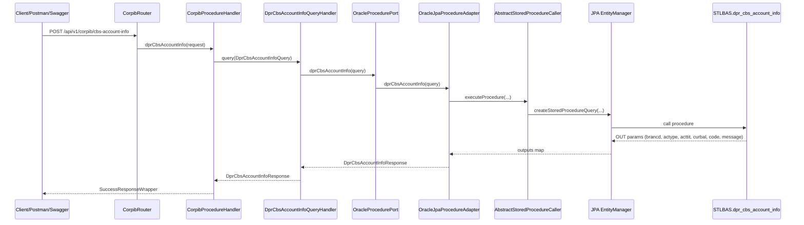

# Oracle Procedure Call Flow (Current Branch)

This document tracks the CORPIB stored procedure `STLBAS.dpr_cbs_account_info` using the default Spring Boot datasource.

## High-level flow (default datasource)



## Procedure call details

Stored procedure signature:

```
PROCEDURE dpr_cbs_account_info (
    in_actnum   IN  VARCHAR2,
    out_brancd  OUT VARCHAR2,
    out_actype  OUT VARCHAR2,
    out_acttit  OUT VARCHAR2,
    out_curbal  OUT NUMBER,
    out_code    OUT VARCHAR2,
    out_message OUT VARCHAR2
)
```

Procedure parameter metadata:
- `src/main/java/com/csio/hexagonal/infrastructure/store/persistence/procedure/DprCbsAccountInfoParam.java`

Procedure execution (named parameters with a single adapter):
- `src/main/java/com/csio/hexagonal/infrastructure/store/persistence/adapter/OracleJpaProcedureAdapter.java`
- `src/main/java/com/csio/hexagonal/infrastructure/store/persistence/procedure/AbstractStoredProcedureCaller.java`

## REST usage

Endpoint:
- `POST /api/v1/corpib/cbs-account-info`

Request body:
```json
{
  "actNum": "08533000197"
}
```

Notes:
- `actNumber` can be accepted via `@JsonAlias` and mapped to `actNum` if needed.

## Datasource configuration (current branch)

Default datasource configured in `src/main/resources/application.properties`:
```
spring.datasource.driver-class-name=oracle.jdbc.OracleDriver
spring.datasource.url=jdbc:oracle:thin:@//192.183.155.12:1535/stlbas
spring.datasource.username=CORPIB
spring.datasource.password=CORPIB
```

There is no datasource routing in this branch; Spring Boot auto-configures JPA from the default datasource.

## Key files (current branch)

- REST entry + OpenAPI:
  - `src/main/java/com/csio/hexagonal/infrastructure/rest/router/operation/corpib/CorpibRouter.java`
  - `src/main/java/com/csio/hexagonal/infrastructure/rest/handler/CorpibProcedureHandler.java`
  - `src/main/java/com/csio/hexagonal/infrastructure/rest/spec/CorpibSpec.java`
  - `src/main/java/com/csio/hexagonal/infrastructure/rest/request/DprCbsAccountInfoRequest.java`
  - `src/main/java/com/csio/hexagonal/infrastructure/rest/response/corpib/DprCbsAccountInfoResponse.java`
- Application layer:
  - `src/main/java/com/csio/hexagonal/application/service/query/DprCbsAccountInfoQueryHandler.java`
  - `src/main/java/com/csio/hexagonal/application/service/query/DprCbsAccountInfoQuery.java`
  - `src/main/java/com/csio/hexagonal/application/port/out/OracleProcedurePort.java`
- Stored procedure execution:
  - `src/main/java/com/csio/hexagonal/infrastructure/store/persistence/adapter/OracleJpaProcedureAdapter.java`
  - `src/main/java/com/csio/hexagonal/infrastructure/store/persistence/procedure/AbstractStoredProcedureCaller.java`
  - `src/main/java/com/csio/hexagonal/infrastructure/store/persistence/procedure/DprCbsAccountInfoParam.java`

## Summary

This branch keeps stored procedure logic inside the infrastructure adapter, uses the outbound port to isolate database details, and relies on the default Spring Boot datasource configured in `application.properties`.
