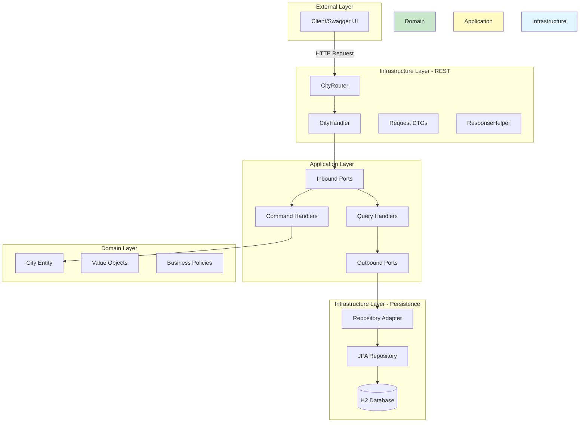
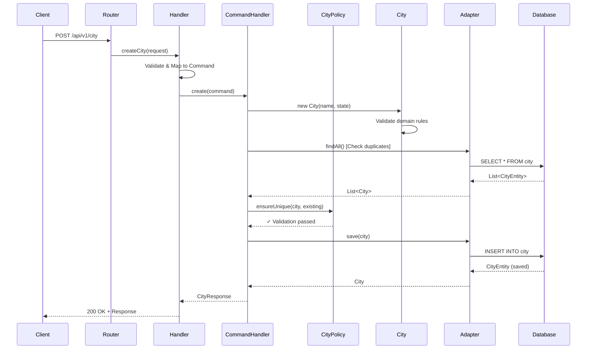
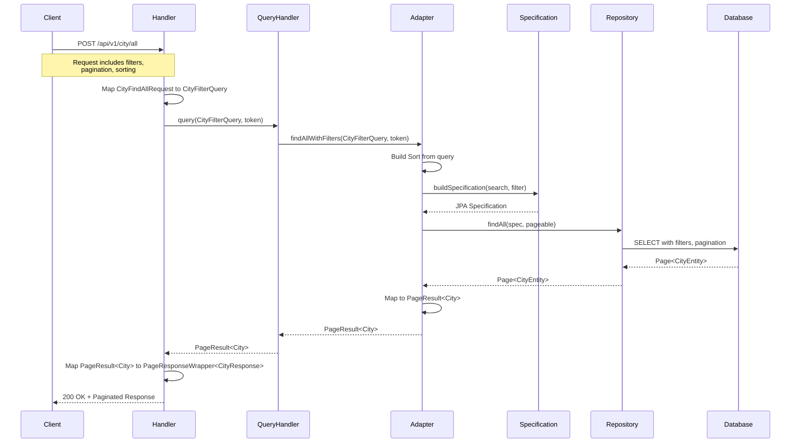

# Spring Hexagonal Architecture - City Service
## A Modern Java Microservice Implementation

---

## 📋 Table of Contents

1. [Introduction](#introduction)
2. [What is Hexagonal Architecture?](#what-is-hexagonal-architecture)
3. [Technology Stack](#technology-stack)
4. [Architecture Overview](#architecture-overview)
5. [Layer-by-Layer Breakdown](#layer-by-layer-breakdown)
6. [Key Features](#key-features)
7. [Data Flow Examples](#data-flow-examples)
8. [API Documentation](#api-documentation)
9. [Design Patterns](#design-patterns)
10. [Setup & Running](#setup--running)
11. [Testing Strategy](#testing-strategy)
12. [Best Practices](#best-practices)
13. [Future Enhancements](#future-enhancements)
14. [Conclusion](#conclusion)

---

## 🎯 Introduction

### Project Overview

This project is a **production-ready City Management Service** built using **Hexagonal Architecture** principles (also known as Ports and Adapters). It demonstrates how to build a maintainable, testable, and flexible Spring Boot application with clear separation of concerns.

### Business Domain

The application manages cities in the United States, providing:
- **Create** operations for adding new cities
- **Read** operations for retrieving city information
- **Advanced filtering** with complex search capabilities
- **Pagination and sorting** for large datasets

### Why This Matters

✅ **Maintainability**: Clear separation of business logic from technical concerns  
✅ **Testability**: Each layer can be tested independently  
✅ **Flexibility**: Easy to swap implementations (databases, APIs, frameworks)  
✅ **Scalability**: Built on reactive Spring WebFlux with proper thread management  
✅ **Domain Focus**: Business logic is protected and isolated

---

## 🏗️ What is Hexagonal Architecture?

### Core Concept

Hexagonal Architecture (Ports and Adapters) is an architectural pattern that **isolates the core business logic** from external concerns like databases, APIs, and frameworks.

```
┌─────────────────────────────────────────────────────┐
│                  External World                     │
│   (UI, REST API, Database, External Services)      │
└────────────────┬──────────────┬─────────────────────┘
                 │              │
         ┌───────▼──────┐ ┌────▼─────────┐
         │   Adapters   │ │   Adapters   │
         │   (Input)    │ │   (Output)   │
         └───────┬──────┘ └────┬─────────┘
                 │              │
         ┌───────▼──────────────▼─────────┐
         │         Ports Layer            │
         │    (Interfaces/Contracts)      │
         └───────┬────────────────────────┘
                 │
         ┌───────▼────────────────────────┐
         │      Application Layer         │
         │   (Use Cases/Services)         │
         └───────┬────────────────────────┘
                 │
         ┌───────▼────────────────────────┐
         │       Domain Layer             │
         │  (Business Logic & Rules)      │
         └────────────────────────────────┘
```

### Key Principles

1. **Dependency Rule**: Dependencies point **inward** toward the domain
2. **Domain Independence**: Core business logic has NO dependencies on frameworks
3. **Ports**: Define **what** the application needs (interfaces)
4. **Adapters**: Implement **how** external systems connect (implementations)

### Benefits

| Benefit | Description |
|---------|-------------|
| **Technology Independence** | Swap databases, frameworks, or APIs without touching business logic |
| **Testability** | Test business logic without infrastructure concerns |
| **Maintainability** | Clear boundaries and responsibilities |
| **Team Scalability** | Teams can work on different layers independently |
| **Future-Proof** | Easy to adapt to changing requirements |

---

## 💻 Technology Stack

### Core Framework
- **Java 25** - Latest LTS features including virtual threads
- **Spring Boot 4.0.1** - Modern Spring framework
- **Spring WebFlux** - Reactive web framework for non-blocking I/O
- **Spring Data JPA** - Data persistence abstraction

### Supporting Libraries
- **MapStruct 1.6.3** - Type-safe bean mapping
- **Lombok** - Reduce boilerplate code
- **Jackson** - JSON serialization/deserialization
- **SpringDoc OpenAPI 3.0.0** - API documentation (Swagger UI)

### Database
- **H2 Database** - In-memory database for development
- **PostgreSQL** - Production-ready database support

### Build Tool
- **Maven** - Dependency management and build automation

### Concurrency Model
- **Virtual Threads** - For blocking I/O operations (database calls)
- **Platform Threads** - For CPU-intensive operations
- **Reactive Streams** - WebFlux for non-blocking HTTP handling

---

## 🏛️ Architecture Overview

### High-Level Architecture Diagram



### Layer Responsibilities

| Layer | Responsibility | Example |
|-------|---------------|---------|
| **Domain** | Business logic, entities, policies | `City`, `CityPolicy`, `State` |
| **Application** | Use cases, orchestration | `CreateCityCommandHandler`, `GetCityQueryHandler` |
| **Infrastructure** | Technical implementations | REST handlers, JPA repositories, config |

---

## 📚 Layer-by-Layer Breakdown

### 1️⃣ Domain Layer (Core)

**Location**: `com.csio.hexagonal.domain`

**Purpose**: Contains pure business logic with zero dependencies on frameworks or external libraries.

#### Components:

**Entities**
```java
// City.java - Core domain entity
public class City {
    private final CityId id;
    private final String name;
    private final State state;
    
    // Business behavior and validation
}
```

**Value Objects**
```java
// CityId.java - Unique identifier (UUID-based)
public record CityId(UUID value) {}

// State.java - US state value object
public record State(String name) {
    // Validation logic for valid US states
}
```

**Business Policies**
```java
// CityPolicy.java - Interface
public interface CityPolicy {
    void ensureUnique(City city, List<City> existingCities);
}

// CityPolicyEnforcer.java - Implementation
@Service
public class CityPolicyEnforcer implements CityPolicy {
    // Business rule enforcement
}
```

**Domain Exceptions**
- `InvalidCityNameException`
- `InvalidStateNameException`
- `DuplicateCityException`

---

### 2️⃣ Application Layer

**Location**: `com.csio.hexagonal.application`

**Purpose**: Orchestrates domain objects to fulfill use cases; implements business workflows.

#### Inbound Ports (What the application provides)

```java
// CommandUseCase.java
public interface CommandUseCase<C, R> {
    R create(C command, String token);
}

// QueryUseCase.java
public interface QueryUseCase<Q, R> {
    R query(Q query, String token);
}
```

#### Use Case Implementations

**Command Handler** (Write operations)
```java
@Service
public class CreateCityCommandHandler 
    implements CommandUseCase<CreateCityCommand, CityResponse> {
    
    private final CityServiceContract cityService;
    private final CityPolicy cityPolicy;
    
    @Override
    public CityResponse create(CreateCityCommand command, String token) {
        // 1. Create domain entity
        // 2. Validate business rules
        // 3. Persist through port
        // 4. Return response
    }
}
```

**Query Handler** (Read operations)
```java
@Service
public class GetAllCityQueryHandler 
    implements QueryUseCase<CityFilterQuery, PageResult<City>> {
    
    private final CityServiceContract cityService;
    
    @Override
    public Mono<PageResult<City>> query(CityFilterQuery query, String token) {
        // 1. Retrieve from repository with filters
        // 2. Return domain PageResult
        // 3. Mapping happens at infrastructure boundary
    }
}
```

#### Outbound Ports (What the application needs)

```java
// CityServiceContract.java - Defines persistence needs
public interface CityServiceContract {
    Optional<City> findByUid(UUID uid, String token);
    List<City> findAll(String token);
    City save(City city, String token);
    PageResult<City> findAllWithFilters(CityFilterQuery query, String token);
    PageResult<City> findAllWithPagination(int page, int size, 
                                           String search, String sort, String token);
}
```

---

### 3️⃣ Infrastructure Layer - REST

**Location**: `com.csio.hexagonal.infrastructure.rest`

**Purpose**: Handles HTTP communication, routing, and API documentation.

#### Router Configuration

```java
@Configuration
public class CityRouter {
    @Bean
    public RouterFunction<ServerResponse> cityRoutes(CityHandler handler) {
        return RouterFunctions.route()
            .POST("/api/v1/city", handler::createCity)
            .GET("/api/v1/city/{id}", handler::getCity)
            .POST("/api/v1/city/all", handler::getAllCity)
            .build();
    }
}
```

#### Handler (Adapter)

```java
@Component
public class CityHandler {
    private final CommandUseCase<CreateCityCommand, City> createUseCase;
    private final QueryUseCase<GetCityQuery, City> getUseCase;
    private final QueryUseCase<CityFilterQuery, PageResult<City>> getAllUseCase;
    
    public Mono<ServerResponse> createCity(ServerRequest request) {
        // 1. Extract and validate request
        // 2. Map to command
        // 3. Execute use case
        // 4. Map domain model to DTO at boundary
        // 5. Return HTTP response
    }
    
    public Mono<ServerResponse> getAllCity(ServerRequest request) {
        // 1. Map CityFindAllRequest to CityFilterQuery at boundary
        // 2. Execute query use case
        // 3. Map domain PageResult<City> to PageResponseWrapper<CityResponse>
        // 4. Return HTTP response
    }
}
```

#### Request DTOs

```java
// CityCreateRequest.java
public record CityCreateRequest(
    @NotBlank String name,
    @NotBlank String state
) {}

// CityFindAllRequest.java - Advanced filtering
public record CityFindAllRequest(
    Integer page,
    Integer size,
    String search,
    List<FilterGroup> filter,
    List<Sort> sort
) {}
```

#### Response Wrappers

```java
// SuccessResponseWrapper.java
public record SuccessResponseWrapper<T>(
    String status,
    T data
) {}

// PageResponseWrapper.java
public record PageResponseWrapper<T>(
    String status,
    MetaResponse meta,
    List<T> data
) {}
```

---

### 4️⃣ Infrastructure Layer - Persistence

**Location**: `com.csio.hexagonal.infrastructure.store.persistence`

**Purpose**: Implements data persistence using JPA and adapters.

#### Repository Adapter (Implements Outbound Port)

```java
@Component
public class CityRepositoryAdapter implements CityServiceContract {
    
    private final CityRepository repository;
    private final CityMapper mapper;
    
    @Override
    public City save(City city, String token) {
        CityEntity entity = mapper.toEntity(city);
        CityEntity saved = repository.save(entity);
        return mapper.toDomain(saved);
    }
    
    @Override
    public PageResult<City> findAllWithFilters(CityFilterQuery query, String token) {
        // Build JPA Specification from CityFilterQuery
        // Apply pagination and sorting
        // Execute query
        // Map Page<CityEntity> to PageResult<City>
    }
}
```

#### JPA Repository

```java
public interface CityRepository extends JpaRepository<CityEntity, Long>,
                                         JpaSpecificationExecutor<CityEntity> {
    Optional<CityEntity> findByUid(String uid);
}
```

#### JPA Entity

```java
@Entity
@Table(name = "city")
public class CityEntity extends AuditableEntity {
    
    @Id
    @GeneratedValue(strategy = GenerationType.IDENTITY)
    private Long id;
    
    @Column(unique = true, nullable = false)
    private String uid;
    
    @Column(nullable = false)
    private String name;
    
    @Column(nullable = false)
    private String state;
}
```

#### Advanced Filtering with Specifications

```java
public class CitySpecification {
    public static Specification<CityEntity> buildSpecification(
        String search,
        List<FilterGroup> filterGroups
    ) {
        // Supports:
        // - Logical operators (AND/OR)
        // - Multiple filter groups
        // - Operators: EQUALS, LIKE, GT, LT, GTE, LTE
        // - Case-insensitive search
    }
}
```

---

### 5️⃣ Infrastructure Layer - Configuration

**Location**: `com.csio.hexagonal.infrastructure.config`

**Purpose**: Configures framework components and infrastructure concerns.

#### Thread Executor Configuration

```java
@Configuration
public class PlatformTaskExecutorConfig {
    
    @Bean("cpuExecutor")
    public TaskExecutor cpuExecutor() {
        // Platform threads for CPU-intensive work
        ThreadPoolTaskExecutor executor = new ThreadPoolTaskExecutor();
        executor.setCorePoolSize(cores);
        executor.setMaxPoolSize(cores * 2);
        return executor;
    }
}

@Configuration
public class VirtualThreadExecutorConfig {
    
    @Bean("virtualExecutor")
    public Executor virtualExecutor() {
        // Virtual threads for I/O operations
        return Executors.newVirtualThreadPerTaskExecutor();
    }
}
```

#### API Documentation Configuration

```java
@Configuration
public class CityGroup implements GroupedOpenApiProvider {
    
    @Override
    public GroupedOpenApi createOpenApiGroup() {
        return GroupedOpenApi.builder()
            .group("city-api")
            .pathsToMatch("/api/v1/city/**")
            .addOperationCustomizer(this::customize)
            .build();
    }
}
```

---

## 🎯 Key Features

### 1. Advanced Filtering System

**Complex Query Support**:
```json
{
  "filter": [
    {
      "logicalOperator": "AND",
      "filters": [
        {
          "filterKey": "name",
          "value": "New",
          "operator": "LIKE",
          "filterType": "STRING"
        },
        {
          "filterKey": "state",
          "value": "CA",
          "operator": "EQUALS",
          "filterType": "STRING"
        }
      ]
    }
  ]
}
```

**Supported Operators**:
- `EQUALS` - Exact match
- `LIKE` - Pattern matching (case-insensitive)
- `GT` / `LT` - Greater than / Less than
- `GTE` / `LTE` - Greater/Less than or equal

**Logical Operators**:
- `AND` - All conditions must match
- `OR` - Any condition must match

### 2. Pagination & Sorting

```json
{
  "page": 1,
  "size": 20,
  "sort": [
    {
      "sortKey": "name",
      "direction": "ASC"
    }
  ]
}
```

**Response**:
```json
{
  "status": "success",
  "meta": {
    "page": 1,
    "size": 20,
    "offset": 0,
    "totalElements": 150,
    "totalPages": 8
  },
  "data": [...]
}
```

### 3. Search Functionality

```json
{
  "search": "francisco"
}
```

Searches across multiple fields:
- City name (case-insensitive)
- State name (case-insensitive)

### 4. Reactive & Non-Blocking

- **Spring WebFlux** for reactive HTTP handling
- **Virtual Threads** for efficient I/O operations
- Proper thread separation:
  - `virtualExecutor` for blocking I/O
  - `cpuExecutor` for CPU-intensive work

### 5. Comprehensive API Documentation

- **Swagger UI** available at `/swagger-ui.html`
- **OpenAPI 3.0** specification
- Grouped API documentation by domain
- Request/response examples
- Validation constraints documented

---

## 🔄 Data Flow Examples

### Example 1: Create City Flow



### Example 2: Get All Cities with Filtering



---

## 📖 API Documentation

### Base URL
```
http://localhost:8080
```

### Endpoints

#### 1. Create City
```http
POST /api/v1/city
Content-Type: application/json

{
  "name": "San Francisco",
  "state": "California"
}
```

**Response**:
```json
{
  "status": "success",
  "data": {
    "uid": "550e8400-e29b-41d4-a716-446655440000",
    "name": "San Francisco",
    "state": "California"
  }
}
```

#### 2. Get City by ID
```http
GET /api/v1/city/{id}
```

**Response**:
```json
{
  "status": "success",
  "data": {
    "uid": "550e8400-e29b-41d4-a716-446655440000",
    "name": "San Francisco",
    "state": "California"
  }
}
```

#### 3. Get All Cities (with filtering)
```http
POST /api/v1/city/all
Content-Type: application/json

{
  "page": 1,
  "size": 10,
  "search": "San",
  "filter": [
    {
      "logicalOperator": "AND",
      "filters": [
        {
          "filterKey": "state",
          "value": "California",
          "operator": "EQUALS",
          "filterType": "STRING"
        }
      ]
    }
  ],
  "sort": [
    {
      "sortKey": "name",
      "direction": "ASC"
    }
  ]
}
```

**Response**:
```json
{
  "status": "success",
  "meta": {
    "page": 1,
    "size": 10,
    "offset": 0,
    "totalElements": 3,
    "totalPages": 1
  },
  "data": [
    {
      "uid": "550e8400-e29b-41d4-a716-446655440000",
      "name": "San Diego",
      "state": "California"
    },
    {
      "uid": "550e8400-e29b-41d4-a716-446655440001",
      "name": "San Francisco",
      "state": "California"
    }
  ]
}
```

### Error Responses

```json
{
  "status": "error",
  "error": {
    "code": "DUPLICATE_CITY",
    "message": "City with name 'San Francisco' already exists",
    "timestamp": "2026-01-08T07:30:00Z"
  }
}
```

---

## 🎨 Design Patterns

### 1. Hexagonal Architecture (Ports & Adapters)
- **Ports**: Interfaces defining contracts (`CommandUseCase`, `CityServiceContract`)
- **Adapters**: Implementations connecting external systems (`CityHandler`, `CityRepositoryAdapter`)

### 2. Command Query Responsibility Segregation (CQRS)
- **Commands**: Write operations (`CreateCityCommand`)
- **Queries**: Read operations (`GetCityQuery` for single city, `CityFilterQuery` for multiple cities with filtering)
- Separate handlers for commands and queries

### 3. Repository Pattern
- Abstracts data access through `CityServiceContract`
- Implementation details hidden from application layer

### 4. Specification Pattern
- Encapsulates query logic in reusable specifications
- `CitySpecification` builds complex JPA queries

### 5. Policy Pattern
- Business rules enforced independently
- `CityPolicyEnforcer` validates business constraints

### 6. Strategy Pattern
- Different executors for different task types
- `virtualExecutor` for I/O, `cpuExecutor` for CPU work

### 7. Factory Pattern
- Domain object creation with validation
- `City.of()` methods for entity creation

### 8. Mapper Pattern
- Transforms between layers
- `CityMapper` for domain ↔ persistence mapping

---

## 🚀 Setup & Running

### Prerequisites
- **Java 25** (JDK)
- **Maven 3.8+**
- **Git**

### Quick Start

1. **Clone the repository**
```bash
git clone https://github.com/rajib-reea/spring-hexagonal-pjt.git
cd spring-hexagonal-pjt
```

2. **Run the application**
```bash
mvn clean spring-boot:run
```

3. **Access the application**
- API Base: `http://localhost:8080`
- Swagger UI: `http://localhost:8080/swagger-ui.html`
- H2 Console: `http://localhost:8080/h2-console`

### Build JAR

```bash
mvn -DskipTests package
java -jar target/hexagonal-0.0.1-SNAPSHOT.jar
```

### Configuration

**application.properties**:
```properties
# Server
server.port=8080

# Database (H2)
spring.datasource.url=jdbc:h2:mem:citydb
spring.datasource.driverClassName=org.h2.Driver
spring.jpa.database-platform=org.hibernate.dialect.H2Dialect

# JPA
spring.jpa.hibernate.ddl-auto=create-drop
spring.jpa.show-sql=true

# Logging
logging.level.com.csio.hexagonal=DEBUG
```

### Docker Support

```bash
docker-compose up -d
```

---

## 🧪 Testing Strategy

### Testing Pyramid

```
                /\
               /  \
              / E2E \
             /--------\
            /   API    \
           /   Tests    \
          /--------------\
         / Integration    \
        /     Tests        \
       /--------------------\
      /     Unit Tests       \
     /________________________\
```

### 1. Unit Tests

**Domain Layer**:
```java
@Test
void shouldCreateValidCity() {
    City city = new City(
        new CityId(UUID.randomUUID()),
        "San Francisco",
        new State("California")
    );
    assertNotNull(city);
    assertEquals("San Francisco", city.getName());
}
```

**Application Layer**:
```java
@Test
void shouldCreateCitySuccessfully() {
    // Mock dependencies
    CityServiceContract service = mock(CityServiceContract.class);
    CityPolicy policy = mock(CityPolicy.class);
    
    // Test use case
    CreateCityCommandHandler handler = 
        new CreateCityCommandHandler(service, policy);
    
    // Execute and verify
    CityResponse response = handler.create(command, "token");
    assertNotNull(response);
}
```

### 2. Integration Tests

**Repository Adapter**:
```java
@DataJpaTest
class CityRepositoryAdapterTest {
    
    @Autowired
    private CityRepository repository;
    
    @Test
    void shouldSaveCityEntity() {
        CityEntity entity = new CityEntity();
        entity.setName("Test City");
        entity.setState("Test State");
        
        CityEntity saved = repository.save(entity);
        assertNotNull(saved.getId());
    }
}
```

### 3. API Tests

**REST Handler**:
```java
@WebFluxTest(CityHandler.class)
class CityHandlerTest {
    
    @Autowired
    private WebTestClient webClient;
    
    @Test
    void shouldCreateCity() {
        webClient.post()
            .uri("/api/v1/city")
            .bodyValue(new CityCreateRequest("Test", "State"))
            .exchange()
            .expectStatus().isOk()
            .expectBody()
            .jsonPath("$.status").isEqualTo("success");
    }
}
```

### Test Coverage Goals

| Layer | Target Coverage |
|-------|----------------|
| Domain | 95%+ |
| Application | 90%+ |
| Infrastructure | 80%+ |

---

## ✨ Best Practices

### 1. Dependency Management

✅ **DO**: Depend on abstractions (interfaces)
```java
private final CityServiceContract service; // Interface
```

❌ **DON'T**: Depend on concrete implementations
```java
private final CityRepositoryAdapter adapter; // Concrete class
```

### 2. Domain Purity

✅ **DO**: Keep domain layer free of framework dependencies
```java
public class City { // Pure Java
    private final CityId id;
    private final String name;
}
```

❌ **DON'T**: Use framework annotations in domain
```java
@Entity // JPA annotation - belongs in infrastructure!
public class City { ... }
```

### 3. Exception Handling

✅ **DO**: Use domain-specific exceptions
```java
throw new DuplicateCityException("City already exists");
```

✅ **DO**: Handle at appropriate layer
```java
@ExceptionHandler(DuplicateCityException.class)
public ResponseEntity<?> handle(DuplicateCityException e) {
    // Convert to HTTP response
}
```

### 4. Immutability

✅ **DO**: Use immutable value objects
```java
public record CityId(UUID value) {}
public record State(String name) {}
```

### 5. Validation

✅ **DO**: Validate at layer boundaries
- **REST Layer**: Input validation (`@Valid`, `@NotBlank`)
- **Domain Layer**: Business rule validation
- **Persistence Layer**: Data integrity validation

### 6. Thread Management

✅ **DO**: Use appropriate executors
```java
// I/O operations
@Async("virtualExecutor")
public CompletableFuture<City> save(City city) { ... }

// CPU operations
@Async("cpuExecutor")
public CompletableFuture<ValidationResult> validate(City city) { ... }
```

### 7. API Design

✅ **DO**: Use appropriate HTTP methods
- `POST` for create
- `GET` for read
- `PUT` for update
- `DELETE` for delete

✅ **DO**: Return meaningful status codes
- `200` - Success
- `201` - Created
- `400` - Bad Request
- `404` - Not Found
- `500` - Server Error

---

## 🔮 Future Enhancements

### Planned Features

1. **Update & Delete Operations**
   - `PUT /api/v1/city/{id}` - Update city
   - `DELETE /api/v1/city/{id}` - Delete city

2. **External API Integration**
   - Weather API integration for cities
   - Population data from Census API
   - Geographic coordinates lookup

3. **Advanced Search**
   - Full-text search with Elasticsearch
   - Fuzzy matching
   - Geographic search (nearby cities)

4. **Caching Layer**
   - Redis integration
   - Cache invalidation strategies
   - Cache-aside pattern

5. **Event-Driven Architecture**
   - Domain events
   - Event sourcing
   - Kafka integration

6. **Security**
   - JWT authentication
   - Role-based access control (RBAC)
   - Rate limiting

7. **Observability**
   - Distributed tracing (Jaeger/Zipkin)
   - Metrics (Prometheus)
   - Centralized logging (ELK stack)

8. **Database Enhancements**
   - Multi-tenancy support
   - Database migration with Flyway
   - Read replicas for scaling

9. **Testing**
   - Contract testing (Pact)
   - Performance testing (JMeter)
   - Chaos engineering (Chaos Monkey)

10. **CI/CD**
    - GitHub Actions workflows
    - Automated testing
    - Container deployment

---

## 📊 Metrics & Monitoring

### Application Metrics

**Spring Boot Actuator**:
- Health checks: `/actuator/health`
- Metrics: `/actuator/metrics`
- Info: `/actuator/info`

**Key Metrics to Monitor**:
- Request throughput
- Response times (p50, p95, p99)
- Error rates
- Database connection pool usage
- Thread pool utilization
- Memory usage

### Logging

**Logback Configuration**:
```xml
<appender name="FILE" class="ch.qos.logback.core.FileAppender">
    <file>logs/app.log</file>
    <encoder>
        <pattern>%d{ISO8601} [%thread] %-5level %logger{36} - %msg%n</pattern>
    </encoder>
</appender>
```

**Log Levels**:
- `ERROR` - Critical issues requiring immediate attention
- `WARN` - Warnings and potential issues
- `INFO` - Important business events
- `DEBUG` - Detailed debugging information
- `TRACE` - Extremely detailed diagnostic information

---

## 🎓 Learning Resources

### Hexagonal Architecture
- [Alistair Cockburn's Original Article](https://alistair.cockburn.us/hexagonal-architecture/)
- [Netflix Tech Blog - Hexagonal Architecture](https://netflixtechblog.com/)

### Spring Boot & WebFlux
- [Spring Boot Documentation](https://spring.io/projects/spring-boot)
- [Spring WebFlux Guide](https://docs.spring.io/spring-framework/reference/web/webflux.html)

### Design Patterns
- "Domain-Driven Design" by Eric Evans
- "Clean Architecture" by Robert C. Martin
- "Patterns of Enterprise Application Architecture" by Martin Fowler

### Reactive Programming
- [Project Reactor Documentation](https://projectreactor.io/docs)
- "Reactive Programming with RxJava" by Tomasz Nurkiewicz

---

## 🤝 Contributing Guidelines

### Code Style
- Follow Java conventions
- Use meaningful variable names
- Keep methods small and focused
- Write self-documenting code

### Commit Messages
```
feat: Add update city endpoint
fix: Resolve duplicate city validation issue
docs: Update API documentation
test: Add integration tests for city service
refactor: Simplify specification builder
```

### Pull Request Process
1. Create a feature branch
2. Write tests for new functionality
3. Ensure all tests pass
4. Update documentation
5. Submit PR with clear description

---

## 📞 Support & Contact

### Issues
Report issues on GitHub: [Issues Page](https://github.com/rajib-reea/spring-hexagonal-pjt/issues)

### Documentation
- [README.md](ReadMe.md) - Quick start guide
- [Architecture.md](Architecture.md) - Detailed architecture diagrams

### API Documentation
- Swagger UI: `http://localhost:8080/swagger-ui.html`
- OpenAPI Spec: `http://localhost:8080/v3/api-docs`

---

## 🎯 Conclusion

### Key Takeaways

1. **Hexagonal Architecture** provides clear separation of concerns and makes the application highly maintainable and testable

2. **Domain-Driven Design** keeps business logic isolated and protected from technical concerns

3. **Modern Spring Boot** with WebFlux and virtual threads provides excellent performance and scalability

4. **CQRS Pattern** separates read and write operations for better optimization and clarity

5. **Comprehensive API Design** with filtering, pagination, and sorting meets real-world requirements

### Why This Architecture Matters

✅ **For Developers**:
- Easy to understand and navigate
- Clear responsibilities and boundaries
- Simple to test and debug

✅ **For Teams**:
- Multiple teams can work independently
- Reduced merge conflicts
- Easier code reviews

✅ **For Business**:
- Quick to adapt to changing requirements
- Lower maintenance costs
- Higher quality and reliability

### Next Steps

1. **Explore the Code**: Clone and run the project
2. **Review Documentation**: Read `Architecture.md` for detailed diagrams
3. **Try the API**: Use Swagger UI to test endpoints
4. **Extend the Project**: Add new features following the patterns
5. **Learn and Adapt**: Apply these principles to your projects

---

## 📝 Appendix

### Project Structure Summary
```
spring-hexagonal-pjt/
├── src/main/java/com/csio/hexagonal/
│   ├── domain/              # Pure business logic
│   ├── application/         # Use cases & ports
│   └── infrastructure/      # Technical implementations
├── src/main/resources/
│   ├── application.properties
│   └── logback-spring.xml
├── Architecture.md          # Detailed architecture diagrams
├── ReadMe.md               # Quick start guide
└── pom.xml                 # Maven configuration
```

### Technology Versions
| Technology | Version |
|------------|---------|
| Java | 25 |
| Spring Boot | 4.0.1 |
| Spring WebFlux | 6.2.1 |
| Spring Data JPA | 4.0.1 |
| MapStruct | 1.6.3 |
| SpringDoc OpenAPI | 3.0.0 |
| H2 Database | Runtime |
| PostgreSQL | 42.7.8 |

### Useful Commands
```bash
# Build
mvn clean install

# Run
mvn spring-boot:run

# Test
mvn test

# Package
mvn package -DskipTests

# Run with profile
mvn spring-boot:run -Dspring-boot.run.profiles=dev
```

---

## 🙏 Acknowledgments

This project demonstrates best practices from:
- Hexagonal Architecture (Alistair Cockburn)
- Domain-Driven Design (Eric Evans)
- Clean Architecture (Robert C. Martin)
- Spring Boot best practices
- Modern Java development patterns

---

**End of Presentation**

*For more information, visit the project repository: https://github.com/rajib-reea/spring-hexagonal-pjt*
